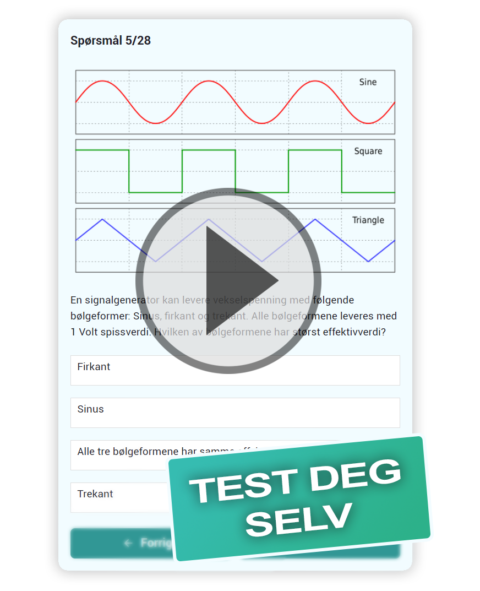

# RadioLisens.no
A website to prepare for the Norwegian  amateur radio license exam.  
Contains real questions from previous exams.  
With the goal to be the best and most effective resource available.

Feel free to 🌟**star**🌟 the project if you like it.  

Click to try it yourself 👇

[](http://radiolisens.no/)


## Download RadioLisens App
Downlaod the RadioLisens app to study with an even better experience.   

Visit [RadioLisens.no](http://radiolisens.no/) and do the following:  

**IOS:** Tap the "Share" button, scroll down and tap "Add to Home Screen"  
**Android:** Tap the three dots menu, tap "Add to Home Screen" 


## Is something wrong?
If you discovered a bug or something isn't working correctly add an issue here on GitHub and it will be looked at. If you are new to GitHub here are [instructions](https://docs.github.com/en/issues/tracking-your-work-with-issues/creating-an-issue) for adding issues.  


## 👋 Help wanted!  
Have ideas for how the site can be improved? Support is greatly appreciated!  

Pull request for issues would be amazing! 😍 Will add you to the credits.

### Finding more old exams
Currently it would be great to add more questions. If you find any previous exams in the last ~12 years that aren't already included please take contact or add an issue about it (Currently found 4. All current questions are [here](exams/questions.json), available at `exams/questions.json`). 

### Adding explanations  
The goal is to learn, not memorize questions. It would therefore be great to include explanations for each question. By adding a comment system the explanations could be crowd sourced. A simple voting system would ensure the best rise to the top. These would routinely be officially added with credit to the creator.  


### Categorizing questions
The [radio amateur regulations](https://lovdata.no/forskrift/2009-11-05-1340/§5) split the questions in 12 categories. If questions where assigned the correct categories it could provide helpful insight into your strengths and weaknesses. The goal would be to display these statistics (for more focused studying) and eventually give personalized questions.

### Adding images
The questions can become a bit dull after a while. It would be nice to include some pictures relevant to the question. This would provide diversity and create a better relationship between the theory and real life implementation (you can see an example in the screenshot).   

________________________

## Technical instructions


This part goes over the technical aspect of the site and is relevant for programmers. 

### Getting started
Clone the repo or download it [here](https://minhaskamal.github.io/DownGit/#/home?url=https://github.com/Jesper-Hustad/radio-lisens).  
In the directory run these commands:
```cmd
npm install
npm run start
```
The website should now be available at port 8000.


### Hosting and codebase

[](https://app.netlify.com/sites/jovial-mcnulty-402595/deploys)  
The site is statically hosted with Netlify. 

If the comment system is implemented this would be trough a json database.

The site is built on Gatsby with [chakra ](https://chakra-ui.com/) for the UI.

### Future implementation
Any pull requests are very welcome. Some basic user login system would eventually need to be implemented. 

Feel free to add an issue with any questions you may have.


